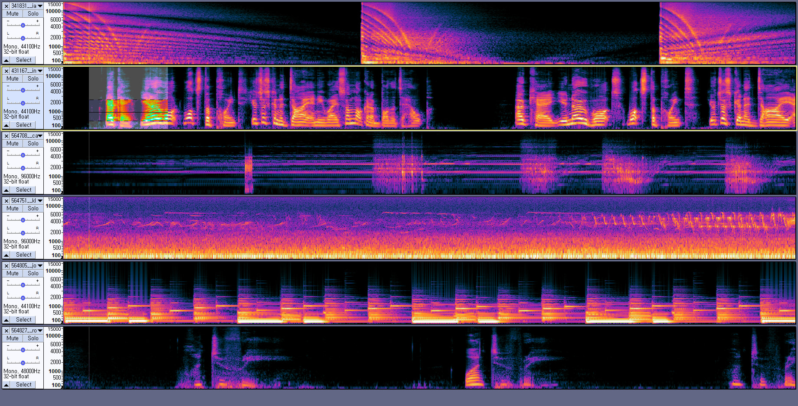
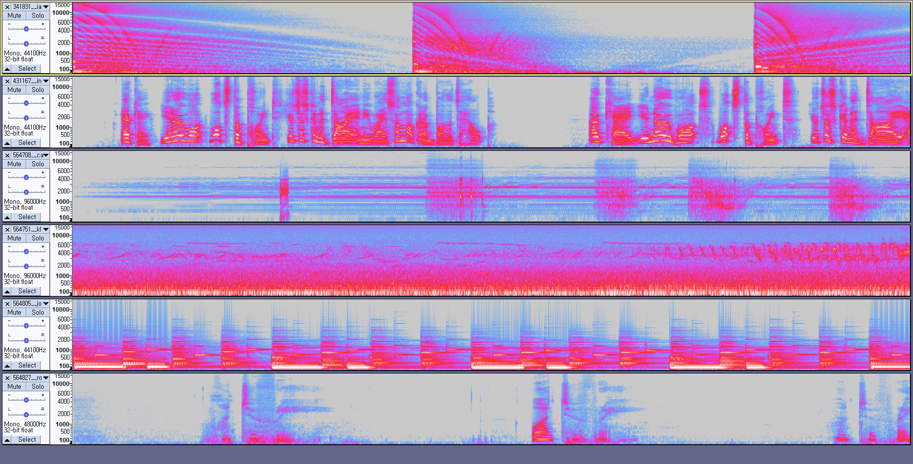
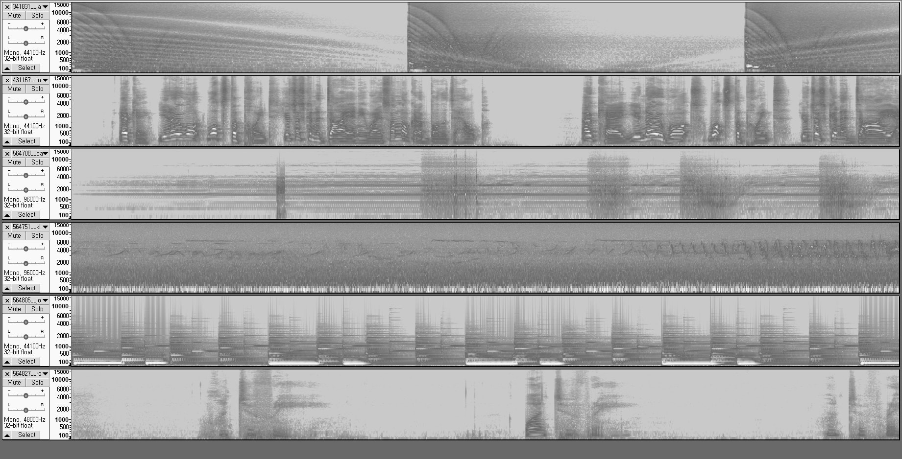
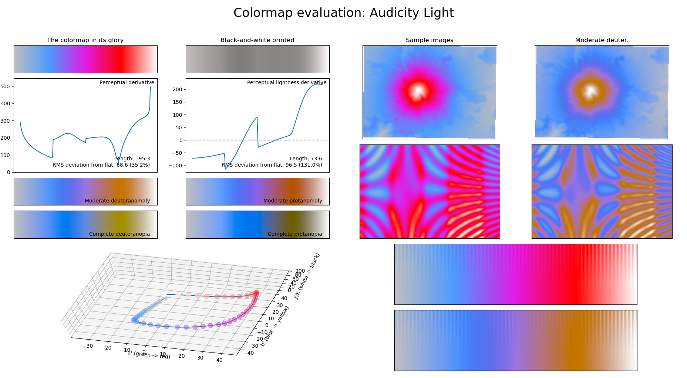
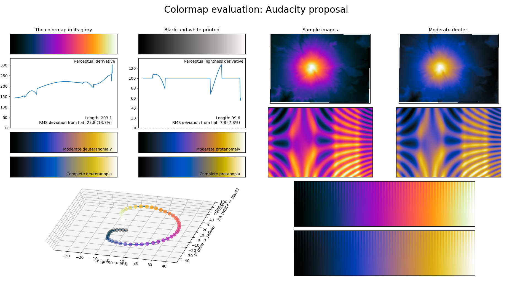
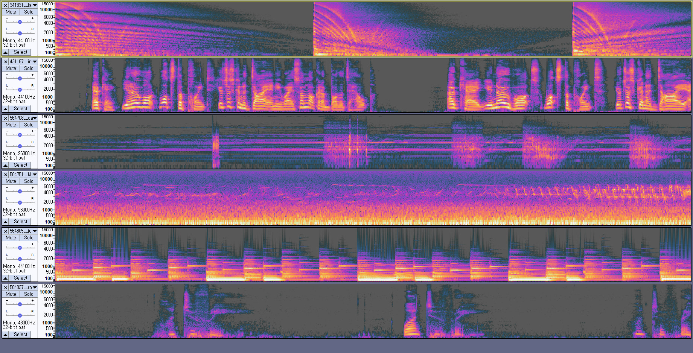
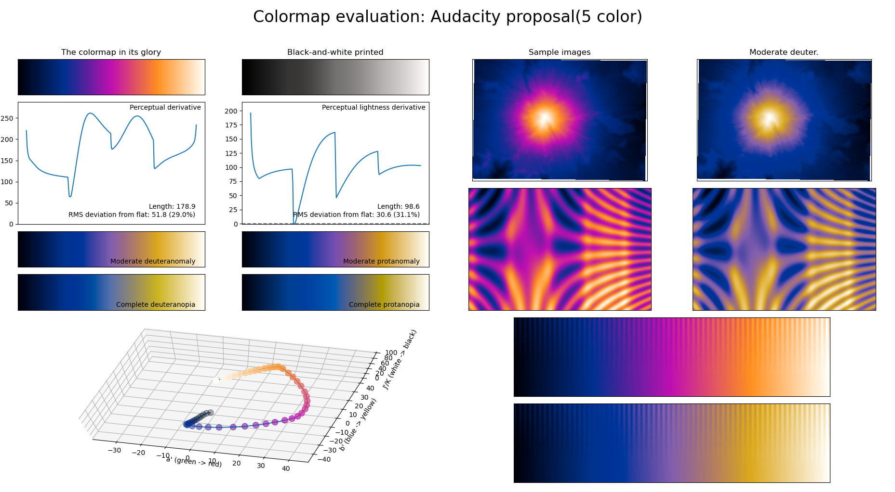

# Audacity sepctrogram colormap proposal

## tl;dr
I suggest new color scheme for audacity spectrogram, which is more pretty and better representing audio.

It looks like this:

Original for comparison:

## Motivation

tl;dr: To make spectrograms that are pretty, better represent audio, easier to read by those with colorblindness, and print well in gray scale.

Here is further readings:  
https://bids.github.io/colormap/  
https://cran.r-project.org/web/packages/viridis/vignettes/intro-to-viridis.html

Audacity's default colormap is quite bad. Especilly when it's printed in greyscale.

Lightness of background and foreground is confusing.

As you can see, greyscale converted colorbar is in a chaos. It should be simple gradient of white and black.

There is huge red bending, which makes spectrogram hard to read.

## The new colormap

Considerings while making the new colormap (in order of priority):
- Wide range of lightness (almost full 0-255)
- Colorful, wide range of hue, chroma
- Originality, keep magenta-ish feeling
- Aim to be perceptually smooth
- Pretty

I wrote python code for generating the colormap.
https://github.com/dofuuz/audacity-colormap

Execute `gen_wheel.py` to generate color wheel. 

Change constants like ANGLE, OFFSET, CCW... and generate different color wheels.

## Obstacles

There are problems for applying the colormap.

### Transparency for sync-lock overlay

Currently, audacity spectrogram has transparency for sync-lock overlay 
https://manual.audacityteam.org/man/sync_locked_track_groups.html

Without disabling this, spectrogram looks like this:

It will affect color even if background is (0, 0, 0) black.

I suggest disabling transparency of spectrogram.

### Themeablilty

Themeability is another problem. A theme can use only 5 colors for spectrogram, which is too small for good color map.

I tried to make 5-color version of the colormap.

Color bendings are clearly visible.

Also, Audacity ignores the "Spectro1", "Spectro1sel" and "SpectroBackground" colors for the sync-lock overlay.

So another suggestion: disabling themeability of spectrogram.

It seems like very few people are considering spectrogram while making theme. So, I think disabling themeability and providing a good preset is much better solution.
