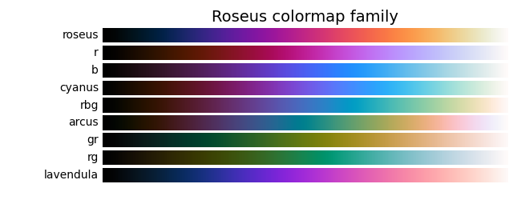
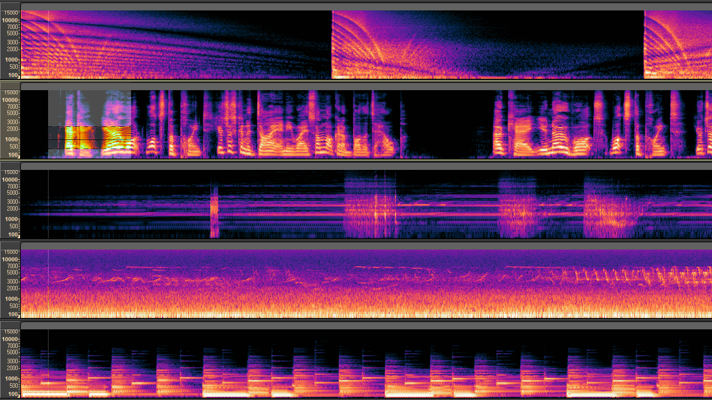
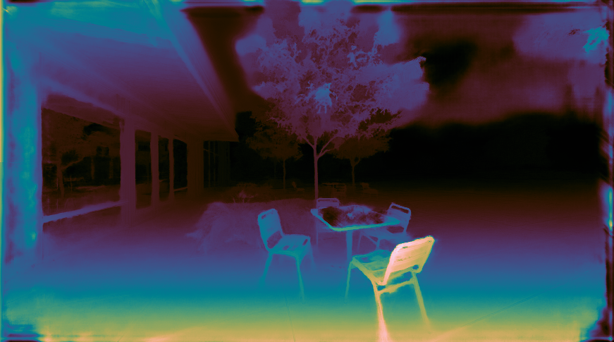
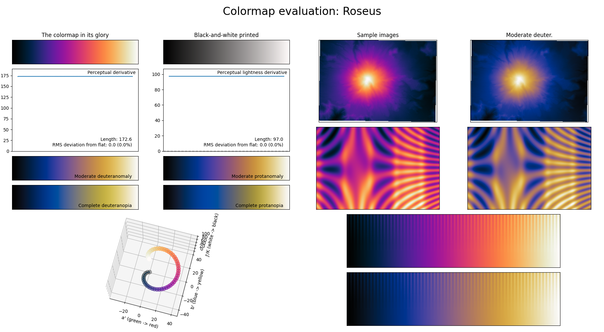
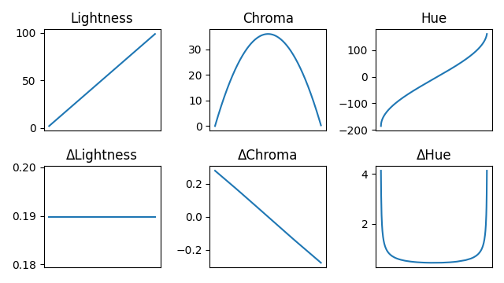

# Roseus colormap family

A perceptually uniform colormaps with **full range of lightness**.


## Preview








## Installation

```sh
pip install roseus
```

If installation fails, upgrade pip with `python -m pip install --upgrade pip` and try again.


## Usage

To use with matplotlib, import `roseus.mpl`.

```python
import matplotlib.pyplot as plt
import roseus.mpl as rs

plt.imshow(x, cmap=rs.arcus)
# or
plt.imshow(x, cmap='rs.arcus')
```

To prevent confusion in namespace, prefix `rs.` is added. (ex. `rs.arcus`, `rs.b`, `rs.gr`, ...)


## Motivation

All colormaps of the Roseus family has (almost) full range of lightness. They have excellent contrast which visualize data more clearly.

Roseus was developed for [Audacity](https://www.audacityteam.org/) spectrogram. More perceptually uniform colormaps are added and aim to be used in a wider range of fields.

Further readings about perceptually uniform colormaps:  
https://bids.github.io/colormap/  
https://cran.r-project.org/web/packages/viridis/vignettes/intro-to-viridis.html


## Look into the colormaps

To plot measures of a colormap in Roseus family,
```sh
pip install "roseus[generate]"
```
install additional dependency. Then,

```python
from roseus.util import plot_measures

plot_measures('roseus')
```

  
Note: [viscm](https://github.com/matplotlib/viscm) used in measurements has been modified to target CAM16-UCS instead of CAM02-UCS.

  
All colormaps has symmetric and [smooth](https://en.wikipedia.org/wiki/Smoothness) chroma, hue transition.


## Changelog

#### v2.0
- Added more colormaps (r, b, cyanus, rbg, arcus, gr, rg, lavendula)
- Packed into Python package

#### v1.0
- The colormap is named 'Roseus'. (inspiration from [Viridis](https://sjmgarnier.github.io/viridis/))
- It was perceptually smooth, but wasn't perceptually uniform. Now it is.
- Roseus now targets CAM16-UCS color space instead of the obsolute CAM02-UCS.

#### [v0.1](https://github.com/dofuuz/roseus/releases/tag/v0.1.0)
- First release for Audacity spectrogram.


### OSS libraries used

#### viscm (MIT)
A tool for analyzing colormaps and creating new colormaps.  
https://github.com/matplotlib/viscm

viscm is not used for generating the Roseus family. It's modified to target CAM16-UCS and included for analysis.
