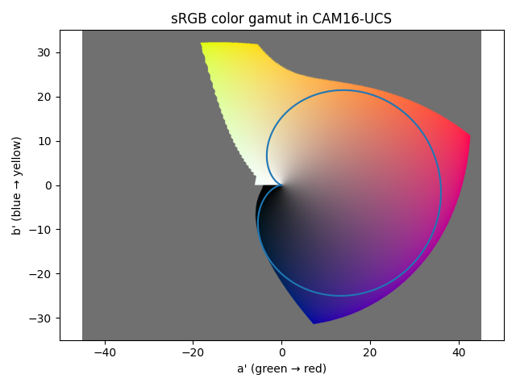
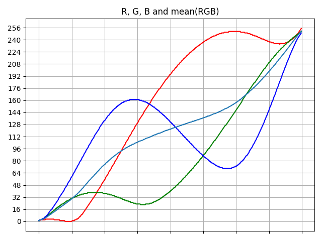

# Roseus colormap

A perceptually uniform colormap with **full range of lightness**.

## Preview

## Motivation

The [previous version](https://github.com/dofuuz/roseus/tree/v0.1.0) of this colormap was developed for Audacity spectrogram. Roseus has now become perceptually uniform and aims to be used in a wider range of fields.

Further readings about perceptually uniform colormaps:  
https://bids.github.io/colormap/  
https://cran.r-project.org/web/packages/viridis/vignettes/intro-to-viridis.html

## The new colormap

Note: [viscm](https://github.com/matplotlib/viscm) used in measurements has been modified to target CAM16-UCS instead of CAM02-UCS.

Considerings while making the new colormap (in order of priority):
- Perceptually uniform
- Wide range of lightness (almost full 0-100)
- Colorful, wide range of hue, chroma
- Originality, keep magenta-ish feeling
- Pretty

## Changes from the previous version

Previous version: [code](https://github.com/dofuuz/roseus/tree/v0.1.0) | [viscm](img/viscm-audaspec.png) | [spectrogram](img/audacity-audaspec1.png)

- It was perceptually smooth, but wasn't perceptually uniform. Now it is.
- Roseus now targets CAM16-UCS color space instead of the obsolute CAM02-UCS.
- The colormap is named 'Roseus'. (inspiration from Viridis)

## Findings and candiates

These are some colormaps made during designing Roseus. They are all perceptually uniform and has almost full range of lightness.

You can generate them using `roseus.py`.

